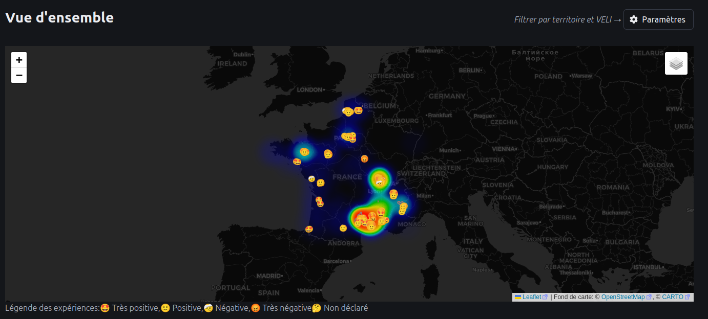

# Dataviz 30 VELI

Le projet d’expérimentation 30 VELI est lancé en partenariat entre l'ADEME et la Fabrique de Mobilités, dans le cadre de l'eXtrême Défi Mobilité. Il consiste à tester 30 véhicules sur 16 territoires entre 2023 et 2025.

Ce tableau bord partage des statistiques générales sur les voyages à bord de ces véhicules, mesurées à partir de capteurs embarqués, ainsi que les expériences des testeurs issus de questionnaires.

Dans une optique d'essaimage, cette branche permet la réutilisation de cette visualisation pour d'autres expérimentations.


*Vue d'ensemble, chaque emoji correspond à un test utilisateur.*


## Structure
Le code de ce tableau de bord est organisé en 2 parties:
* le code de traitement des données (data_processing), le dossier contient un readme détaillé sur le mécanisme de traitement des données brutes.
* le code de la dataviz, divisé en frontend et backend.

Le code puise dans deux sources de données:
* Des données GPS, issues de capteurs embarqués, récupérées via une API du fournisseur Carmoove.
* Un questionnaire "Carnet de bord" partagé aux testeurs. Un template préconfiguré est disponible dans le dossier `docs`, utilisable avec l'outil Grist, dont une instance est proposée par La Suite Numérique du gouvernement français.

Ces sources nécessitent une configuration avant usage. Les documents suivants détaillent les étapes d'installation et de configuration:
* Installation de la dataviz: ci-dessous
* Installation et configuration du processus de récupération et traitement des données: dans le dossier `data_processing`
* Explication sur le bon usage du template: dans la table "Lisez moi" après chargement du document dans grist
* Enfin, une vidéo commentée présentant l'ensemble des étapes d'installation et de configuration: https://youtu.be/oqK0XUA0MJY

## Installation et démarrage de la dataviz
La base de données `data.db` utilisée pour nourrir le tableau de bord est générée par le code de traitement des données. Consultez le dossier `data_processing` pour plus de détails.

De son côté, la dataviz est construite en utilisant Node v20+, TypeScript et React. Pour installer les dépendances, exécutez la commande suivante:
```bash
npm install
```

Ensuite, pour build et démarrer le serveur, exécutez les commandes suivantes:
```bash
npm run build
node dist/index.js
```

Une fonctionalité de build dynamique est disponible en environnement de développement:

```bash
# Dans un premier terminal
npm run build:dev
```

```bash
# Dans un second terminal
npm run start:dev
```

Une fois le serveur démarré, vous pouvez accéder à la dataviz en allant sur l'URL suivante dans votre navigateur:
```
http://localhost:8081
```

